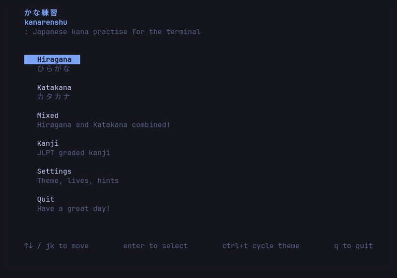
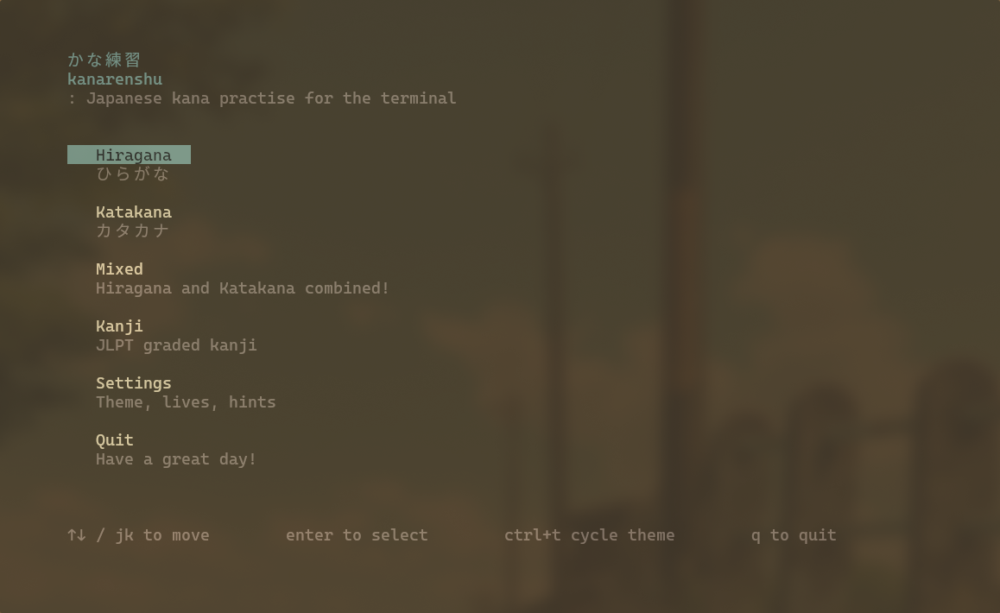
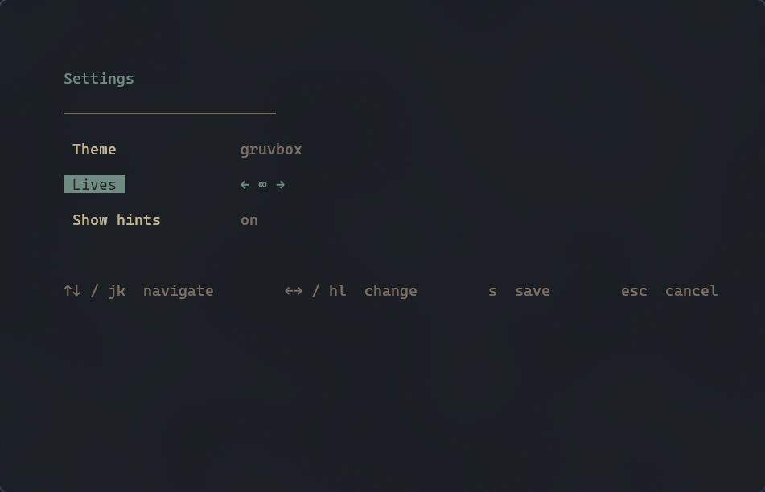
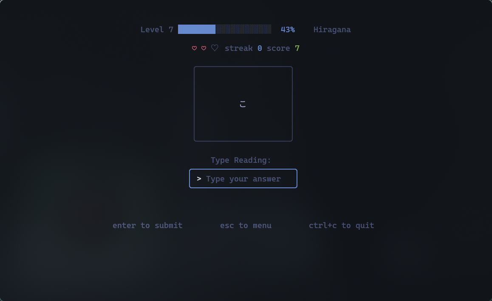
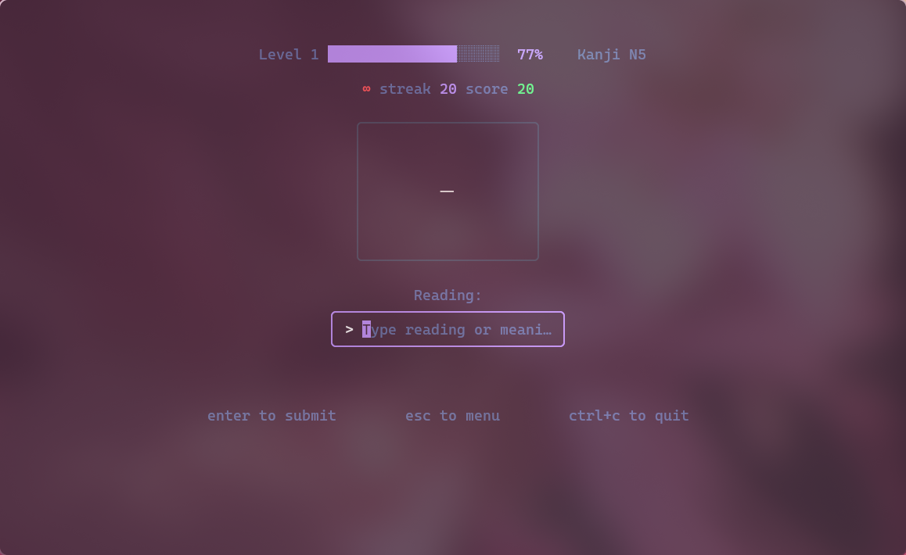

<p align="center">
  
</p>

---

## Features
- **Hiragana, Katakana, and Mixed** modes for kana practise.
- **Kanji mode**: Graded by JLPT level (the app supports only N5 level currently), testing on on'yomi, kun'yomi, and English meaning.
- **Weight-based character selection** - Characters you answer wrong appear more often, while mastered ones fade out.
- **Level-based progression system** - Unlock new characters as you level up.
- **Per-character stats**: Tracked separately for each mode, including each kanji tier.
- **5 built-in themes**: Tokyo Night, Catppuccin, Gruvbox, Nord, Dracula. Cycle through each theme using `ctrl + t` or get a live preview from the settings menu.
- **Configurable** - lives, hints, and theme, editable via config file or the in-app settings menu.

<table>
  <tr>
    <td width="50%"></td>
    <td width="50%"></td>
  </tr>
  <tr>
    <td width="50%"></td>
    <td width="50%"></td>
  </tr>
</table>

---

## Installation

### AUR
Using Yay:
```bash
yay -S kanarenshu
```

Using Paru:
```bash
paru -S kanarenshu
```

### Nix
Nix users can directly use this repository to get the latest kanarenshu for their system.

Add in your `flake.nix`:
```nix
inputs.kanarenshu.url = "github:nuixyz/kanarenshu";
```

Pass inputs to your modules and then in `configuration.nix`:
```nix
environment.systemPackages = [
  inputs.kanarenshu.packages.${pkgs.stdenv.hostPlatform.system}.default
];
```

### Homebrew
Coming soon

### From Source
```bash
git clone https://github.com/nuixyz/kanarenshu
cd kanarenshu
go build ./cmd/kanarenshu
```

### Requirements

- Go 1.21 or later (uses `//go:embed`)

---

## Usage

```
kanarenshu
```

Use the arrow keys or `j/k` to navigate the menu, 
`enter` to select.

### Keyboard shortcuts
 
| Key | Action |
|-----|--------|
| `enter` | Submit answer |
| `esc` | Return to menu |
| `ctrl+t` | Cycle through themes |
| `ctrl+c` | Quit |
| `q` | Quit (menu) |
| `s` | Open settings (menu) |

### Romaji input

Both strict Hepburn and common alternatives are accepted by default:
 
| Kana | Accepted |
|------|----------|
| し | `shi`, `si` |
| ち | `chi`, `ti` |
| つ | `tsu`, `tu` |
| ふ | `fu`, `hu` |
| じ | `ji`, `zi` |
| ん | `n`, `nn` |

### Kanji mode

Select **Kanji** from the main menu, then choose a JLPT level. For each character, any of its on'yomi readings, kun'yomi readings or the English meanings are accepted as a correct answer. A wrong answer reveals the readings and meanings as a hint. Progress of each JLPT tier is tracked independently.

---

## Progression

Kana are grouped into levels of 5, kanji are grouped into levels of 10. The app uses an adaptive learning algorithm to determine how often a character appears in a group:

- A correct answer halves a character's weight.
- A wrong answer doubles it (capped at the initial weight of 400).
- A character is considered mastered once it reaches a threshold weight of 25 or below.
- A level up condition is triggered once every character in the current group is mastered.

The highest unlocked level for each mode is saved automatically and resumed on next launch.

---

## Configuration

On first run, kananrenshu creates a config file at:

```
~/.config/kanarenshu/config.toml
```

```toml
theme         = "tokyo-night"   # tokyo-night | catppuccin | gruvbox | nord | dracula
lives         = 3               # 0 = infinite
romaji_strict = false           # true = Hepburn only (e.g. "shi", not "si")
show_hints    = true            # show reading hint after a wrong answer
```

Changes take effect on next launch, or can be applied live via the in-app settings menu

---

## Themes

Themes can be changed in the settings menu (`s` from the main menu) or cycled in-session with `ctrl+t`. The selected theme is saved to config automatically on save.
 
| Name | |
|------|-|
| `tokyo-night` | Dark blue — default |
| `catppuccin` | Catppuccin Mocha |
| `gruvbox` | Gruvbox Dark |
| `nord` | Nord |
| `dracula` | Dracula |
 
---

## Data files
 
| Path | Contents |
|------|----------|
| `~/.config/kanarenshu/config.toml` | User configuration |
| `~/.local/share/kanarenshu/progress.json` | Level progress and per-character statistics |
| `~/.local/share/kanarenshu/debug.log` | Debug log |
 
XDG environment variables (`$XDG_CONFIG_HOME`, `$XDG_DATA_HOME`) are respected if set.
 
---

## Project layout
 
```
cmd/kanarenshu/         entry point
internal/data/          hiragana, katakana, and kanji groupings; per level pools
internal/game/          session logic, scoring, weight-based progression
internal/storage/       config and progress persistence
internal/theme/         embedded TOML theme palettes
internal/ui/            Bubble Tea screens and reusable components
pkg/romaji/             kana <-> romaji tables and answer checking
pkg/kanji/              kanji data and answer validation (readings/meanings)
```
 
---

## Dependencies
 
- [Bubble Tea](https://github.com/charmbracelet/bubbletea) — TUI framework
- [Bubbles](https://github.com/charmbracelet/bubbles) — UI components
- [Lip Gloss](https://github.com/charmbracelet/lipgloss) — Styles and layout
- [BurntSushi/toml](https://github.com/BurntSushi/toml) — TOML parsing

---
 
## License
 
MIT
